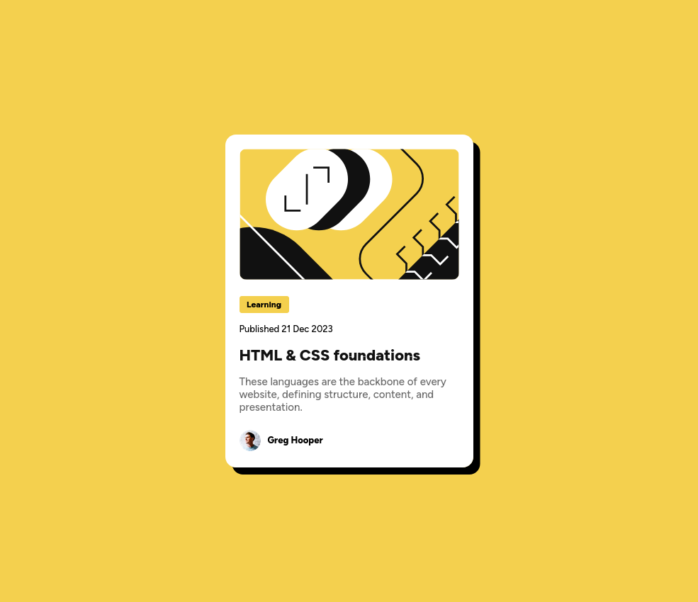
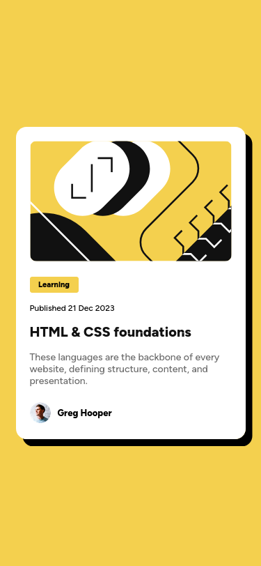

# Frontend Mentor - Blog preview card solution

This is a solution to the [Blog preview card challenge on Frontend Mentor](https://www.frontendmentor.io/challenges/blog-preview-card-ckPaj01IcS). Frontend Mentor challenges help you improve your coding skills by building realistic projects. 

## Table of contents

- [Overview](#overview)
  - [The challenge](#the-challenge)
  - [Screenshot](#screenshot)
  - [Links](#links)
- [My process](#my-process)
  - [Built with](#built-with)
  - [What I learned](#what-i-learned)
  - [Continued development](#continued-development)
  - [Useful resources](#useful-resources)
- [Author](#author)
- [Acknowledgments](#acknowledgments)


## Overview

### The challenge

Users should be able to:

- See hover and focus states for all interactive elements on the page

### Screenshot




### Links

- Solution URL: [https://github.com/Barcode77/Blog-Preview-Card]()
- Live Site URL: [barcode77.github.io/Blog-Preview-Card/](https://your-live-site-url.com)

## My process

### Built with

- Semantic HTML5 markup
- CSS custom properties
- Flexbox


# What I learned
The blog preview challenge has taught me how adapt my approach to coding.
Taking time to see, and notice the structure, flow, first.
To spend my time in the inspect box more than development area. as its why i get to quickly test.
With this, I appreciated the work of community feedback, and how we write unorganized code that me be unreadable.
So i added comments. and whitespace to improve readability.
I also used feedback from previous projects,and used media queries!


```
@media (max-width: 375px) {
  body{
        width:330px;
    }

    h2{
        font-size: 2.0rem;
    }

    /*-------- P elements -----*/
    main p {
        font-size: 1.4rem;
    }
    .learning{
        font-size: 1.1rem;
    }
    .published {
        font-size: 1.2rem;
    }
    footer p{
        font-size: 1.3rem;
    }
```


### Continued development

In coming projects, i seek to improve on fonts. and responsive design

### Useful resources

- [https://www.codecademy.com/enrolled/courses/learn-css-variables-and-functions](https://www.example.com) - Lesson on variables

## Author

- Website - [https://barcode77.github.io/mywebsite/](https://www.your-site.com)
- Frontend Mentor - [Barcode77](https://www.frontendmentor.io/profile/yourusername)
- Twitter - [@ed_all_at_once](https://www.twitter.com/yourusername)


## Acknowledgments
Thanks to these peeps in Front-end mentor:

1.@hitmorecode: [https://github.com/hitmorecode](..)

2.@AdrianoEscarabote: [https://github.com/AdrianoEscarabote](..)

For outstanding moral support!

